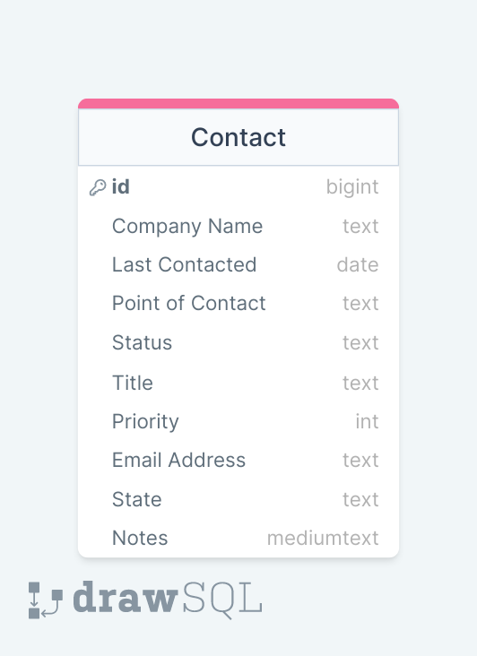

## LightCRM Portfolio Project

### Overview

LightCRM is an easy to use friction less contact manager. Stripped of clunky unessential features LightCRM
gives you exactly what you need to stay on top of your contacts.

### Technologies Used:

\*\*Backend
Backend Repo

- Django
- Python
- MongoDB◊
- SendGrid API

\*\*Frontend
Frontend Repo

- HTML
- CSS
- -Javascript
- ReactJS
- Bootstrap

---

###Routes
\*\*Frontend Routes

/ | GET | Index | **Description: Show all contacts
/new | GET | New | **Description: Create new contact
/contact/:Id | GET | show | **Description: Show contact with :id
/contact/:Id/edit | GET | show | **Description: Show edit form for contact with :id
/contact/:Id/delete | GET | show | \*\*Description: Show delete form for contact with :id

\*\*Backend Routes

/ | POST | Create | **Description: Create a contact
/:id | PATCH | Update | U**Description: Update contact with :id
/:id | DELETE | Destroy | \*\*Description: Delete contact with :id

---

###React Components Overview

\*\*Search bar
Allow users to search for specific contacts and add new contacts.

\*\*Contact List
Display list of all contacts in the CRM

\*\*Contact Details
Display additional details about individual contact

\*\*Notes
Widget for user to add notes about individual contact and see previous notes.

---

### Model

### Website Mockup

◊

